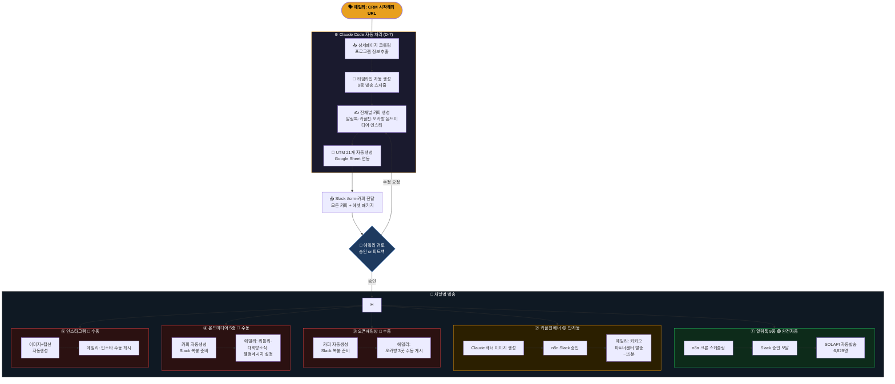
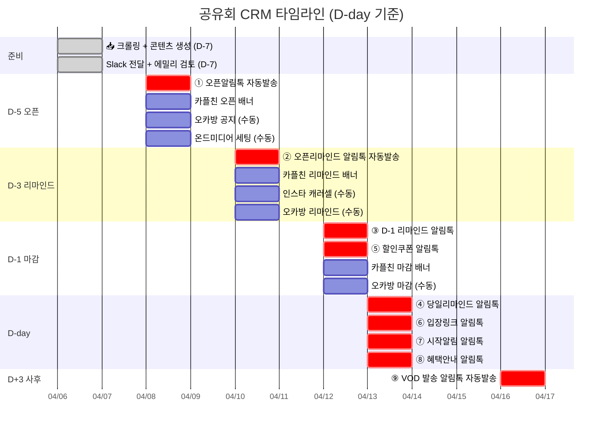
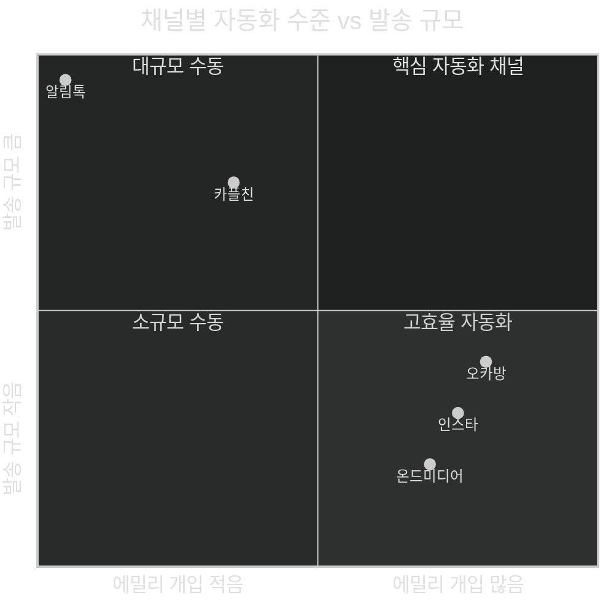
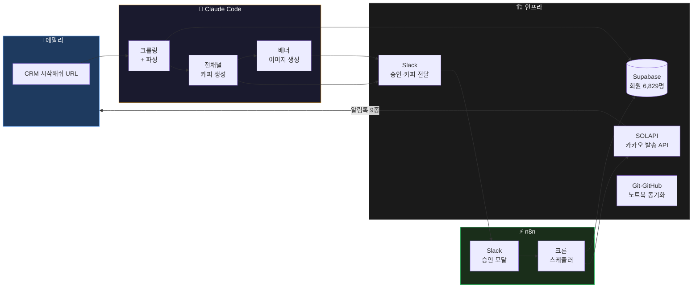

# 셀피쉬클럽 공유회 CRM 자동화 아키텍처

## 전체 파이프라인 플로우

---

## 타임라인 뷰 (공유회 1회 기준)

---

## 자동화 레벨 요약

---

## 기술 스택 연결도

---

## 핵심 지표

| 항목 | Before | After |
|------|--------|-------|
| 공유회 1회 CRM 준비 시간 | **2시간** | **30분** |
| 알림톡 종수 | 9종 | 9종 (완전 자동) |
| 대상 회원 수 | 6,829명 | 6,829명 |
| 채널 수 | 5채널 | 5채널 |
| 메시지 총 발송 수 | 20+ 건 | 20+ 건 |
| 에밀리 직접 입력 | 모든 카피 | 수동 채널 복붙만 |

> **자동화 레벨**: 🟢 알림톡 (100% 자동) | 🟡 카플친 (카피·이미지 자동, 발송 수동 15분) | 🔴 오카방·온드미디어·인스타 (카피 자동, 게시 수동)
